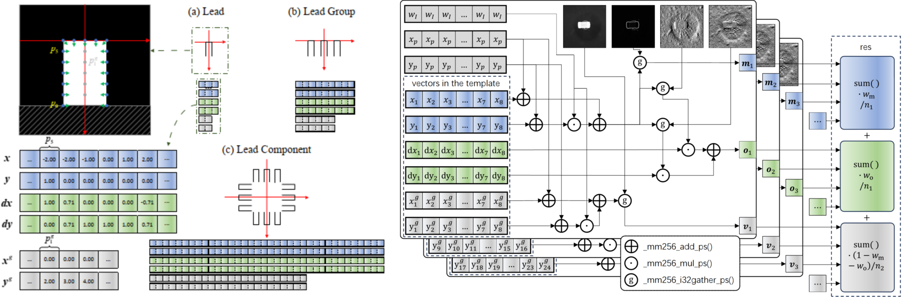

# CompMatch

This repository provides the official implementation of our paper:

**"A Fast Template Matching Method for Pose Estimation of Surface Mount Components"**

## Abstract
Precise pose estimation of surface mount components is challenged by high PCB density, illumination variations, and parametric data storage. We propose a parametric template generator with a hybrid similarity measure to reduce translational bias. A gradient-magnitude reduction step speeds up processing, while an anti-tilt template and a subpixel precision compensation module curb rotational error. In the box-type component multi-illumination dataset experiment, the translational measurement uncertainty of our proposed algorithm reached 0.4854 pixels, and the rotational measurement uncertainty reached 0.3597°.

## Framework Architecture


## Projects Introduction
Please ensure that the project has the following structure.

```
CompMatch/
├── .git/
├── .files/
├── Data/
│   ├── tra/
│   ├── rot/
│   ├── lig_rect/
│   ├── lig_qbc/
│   └── dl/
├── CalMse/
├── CompMatch/
├── HalconNCC/
├── HalconSHM/
├── PoseMatch-TDCM/
├── YoloObb/
└── README.md
```

The following is an introduction to each subproject in the engineering project.

- Data :  
The datasets are available at: [Google Drive](https://drive.google.com/file/d/1hpJEu9WIpvcKOeXSKEhu3e04e28PkhgC/view?usp=sharing), [Quark Drive](https://pan.quark.cn/s/3fc9a5002dd8?pwd=UZcw).  
tra -> The dataset of 0603 box-type components used to evaluate the measurement uncertainty of translation was under fixed illumination.  
rot -> The dataset of 0603 box-type components used to evaluate the measurement uncertainty of rotation was under fixed illumination.  
lig_rect -> The 0603 box-type component dataset used for evaluating measurement uncertainty under varying illumination.  
lig_qbc -> The lead and ball component dataset used for evaluating measurement uncertainty under varying illumination.  
dl -> The dataset of the 0603 box-type components used for neural network training was obtained under varying illumination.  

- CalMse :  
A tool for calculating standard uncertainty, MAE and other metrics.

- CompMatch :  
The method we proposed.

- HalconNCC :  
Implement matching of SMCs using the FindNccModel function in Halcon.

- HalconSHM :  
Implement matching of SMCs using the FindShapeModel function in Halcon.

- PoseMatch-TDCM :  
Implement matching of SMCs using the PoseMatch-TDCM.

- YoloObb :  
Implement matching of SMCs using the YOLO26n-OBB.

Note: The installation and usage methods for each subproject can be found in the README.md file within each subproject.

## Hardware Configuration of the Experimental Platform
- Intel Core i9-14900K (Default settings)
- DDR5 2 × 16 GB (No XMP enabled)
- NVMe PCIe 4.0 1 TB SSD

## Software Environment
- Windows 11
- Visual Studio 2022
- OpenCV 4.12.0 
- Halcon 23.05
- Eigen 3
- python 3.11.15
- torch 2.8.0

## Credits
- https://github.com/opencv/opencv
- https://gitlab.com/libeigen/eigen
- https://github.com/nlohmann/json
- https://www.mvtec.com/cn/products/halcon
- https://github.com/ZhouJ6610/PoseMatch-TDCM
- https://github.com/ultralytics/ultralytics
